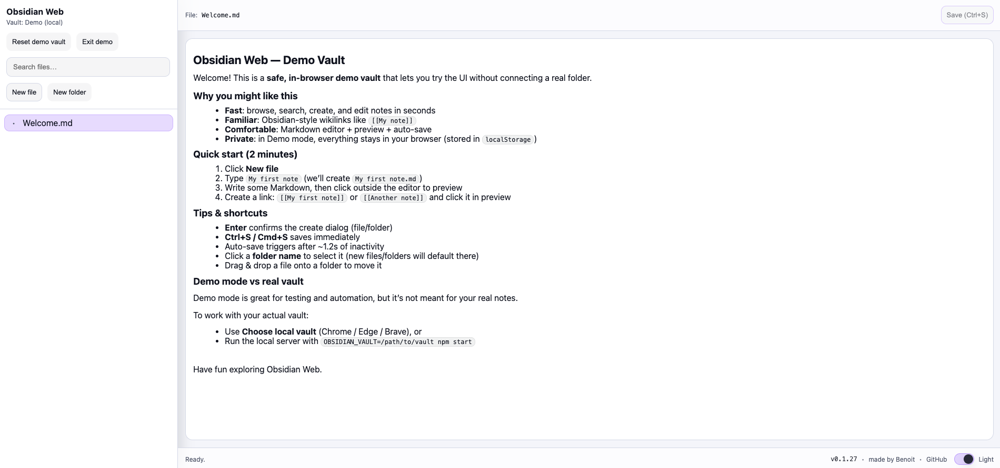

<p align="center">
  
</p>

# Browsidian W
Browsidian is a local web app to browse and edit an Obsidian vault directly in your browser.



It supports four working modes:

- **Server mode**: a local Node.js server reads/writes files on disk in a configured vault folder.
- **Browser mode**: the browser accesses a folder you pick (File System Access API) and edits it directly (no vault configured on the server).
- **Demo mode**: a small in-browser “vault” stored in `localStorage` (useful for agents or browsers without folder picker support).
"Dropbox mode" removed.

## Features

- Browse vault folders and files (tree view)
- Search files by path/name (client-side filter)
- Create folders and files
- In creation dialogs, press Enter to confirm
- New files must be Markdown (`.md`)
- Edit Markdown with **auto-save** (~1s inactivity) and **Ctrl+S**
- **Preview mode** (Obsidian-style Markdown → HTML) when not focused; click to edit Markdown - Live line by line render
- Non-`.md` files show "File not supported" in preview
- Obsidian **wikilinks** in preview: `[[Note]]`, `[[Note|Alias]]` (click to navigate)
- Basic Markdown tables in preview
- Drag & drop a file/folders to move it
- Click a folder to select it (used as default destination for new files/folders)
- Dark / Light mode toggle (persisted in `localStorage`)
- Subtle, consistent UI styling (dark + light)
- Flat, subtle SVG icon set (no external dependencies)
- App logo + favicon
- Footer shows app version (from `/api/config` when available)
- Allow remote using with Authentication per vault
- Now able to render image
- Add some more shortcuts - will note later

## Requirements

- Node.js 18+ (recommended)
- For **Browser mode**: Chrome / Edge / Brave (File System Access API)

## Production

Use the hosted app (Browser + Demo modes):

- https://browsidian.app.lamouche.fr/

Notes:

- The hosted app cannot access your filesystem in Server mode. Use Browser mode (folder picker) or Demo mode.
- The hosted app exposes `/api/config` (for the version), but not the vault file APIs.

## Getting started

### Server mode (recommended for full Obsidian vault access)

Start the server with a vault:

```bash
node server.js --vault /path/to/your/vault
```

Or via env var:

```bash
OBSIDIAN_VAULT=/path/to/your/vault npm start
```

Or with npm args forwarded through `--`:

```bash
npm start -- --vault /path/to/your/vault
```

Open: `http://127.0.0.1:4173`

### Vite dev mode

Run the frontend through Vite and the backend API on a companion port:

```bash
npm run dev -- --vault /path/to/your/vault
```

Open: `http://127.0.0.1:5173`

Build for production:

```bash
npm run build
```

### Browser mode (no server vault)

Start the server without `OBSIDIAN_VAULT`/`--vault`:

```bash
npm start
```

Open the app, then click **Choose local vault** and select your vault folder.

### Demo mode

If your browser (or an automation agent) cannot use the folder picker, click **Try demo vault** in the “Open a vault” dialog.
The demo opens `Welcome.md` by default.

<!-- Dropbox mode documentation removed -->

## Contributing (GitHub workflow)

This project uses a simple GitHub collaboration flow: work on a dedicated branch, then open a Pull Request (PR) to merge into `main`.

### 1) Create a working branch

Always branch from `main` and use the `features/my-feature` naming convention:

```bash
git checkout main
git pull --ff-only
git checkout -b features/my-feature
```

### 2) Develop and commit

- Keep changes focused (small PRs are easier to review).
- Use clear commit messages (what/why). If you rewrite history on your branch, use `git push --force-with-lease` (never on `main`).
- Update documentation (`README.md`) when behavior/usage changes.
- Avoid committing personal vault content or secrets (this app is meant to run locally).

### 3) Push and open a Pull Request

```bash
git push -u origin features/my-feature
```

Then on GitHub:

- Open a **Pull Request** from `features/my-feature` → `main`.
- Describe the change, add screenshots if UI changes, and list any manual checks you ran (e.g. `npm start`).
- Request a review and address feedback with follow-up commits.

### 4) Keep your branch up to date (optional)

If `main` moved while you were working:

```bash
git fetch origin
git rebase origin/main
```

## UI behavior

- **Preview vs Edit**
  - When a file is opened, the app shows an HTML preview.
  - Click the preview to switch to Markdown editing.
  - When the editor loses focus, it switches back to preview.
- **Vault controls**
  - Change/Disconnect actions are shown next to the current vault name.
- **Folder selection**
  - Click a folder row (name) to select it.
  - Selecting a folder clears the currently selected file.
  - Creating a new file/folder pre-fills its path using the selected folder.
  - Click the folder icon to expand/collapse.
  - When a folder path is pre-filled (ending with `/`), the cursor is placed at the end (no auto-selection).
- **Saving**
  - Auto-save runs after ~1.2s without typing (when a file is dirty).
  - You can always press **Ctrl+S** (or click **Save**) to save immediately.
- **Moving files**
  - Drag a file from the tree and drop it on a folder to move it there (a confirmation dialog is shown).
  - You can also drop on empty tree space to move into the selected folder (or the vault root if none is selected).

## Markdown preview support (basic)

The preview is intentionally local and dependency-free. It supports:

- Headings (`#` to `######`) with anchor ids
- Paragraphs
- Line breaks inside paragraphs (single newline → line break)
- Bold/italic, strikethrough, and highlight
- Inline code and fenced code blocks (```…```)
- Blockquotes and Obsidian-style callouts (`> [!note]`)
- Horizontal rules
- Links: `[label](https://example.com)`
- Images: ``
- Tables (header + separator row, basic alignment)
- Ordered and unordered lists, including nested lists
- Task lists (`- [ ]`, `- [x]`)
- Obsidian wikilinks: `[[Note]]`, `[[Note|Alias]]`
- Raw URLs and autolinks (`https://example.com`, `<https://example.com>`)
- Obsidian tags: `#tag` and `#tag/sub-tag`

Notes:

- Section anchors in wikilinks (e.g. `[[Note#Heading]]`) are ignored for now (the file opens, but it does not scroll).
- Table alignment markers are supported in a basic way (`:---`, `---:`, `:---:`).

## Security model

- In **Server mode**, file operations are restricted to the configured vault root (prevents `..` path traversal).
- In both modes, some directories are hidden from the tree: `.obsidian`, `.git`, `node_modules`, `.trash`, `.DS_Store`.
- In **Demo mode**, files are stored in your browser `localStorage` (no disk access).
- This app is meant to run locally on your laptop. Do not expose it publicly.

## Troubleshooting

- **I still see old UI text / behavior**
  - Hard refresh the page (disable cache).
  - Ensure you restarted the running `node server.js` process.
- **Choose local vault button is disabled**
  - Use Chrome/Edge/Brave and serve the app from `http://127.0.0.1` (recommended).
- **I can’t edit files in Browser mode**
  - The browser will ask for permission to read/write the selected folder. Accept it.

## License

Not specified.
